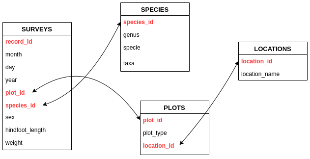
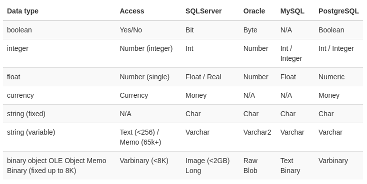

name: prereqs
```{r setup, include=FALSE}
options(htmltools.dir.version = FALSE)
knitr::opts_chunk$set(
  fig.width=9, fig.height=3.5, fig.retina=3,
  out.width = "100%",
  cache = FALSE,
  echo = TRUE,
  message = FALSE, 
  warning = FALSE,
  fig.show = TRUE,
  hiline = TRUE
)
```

```{r xaringan-themer, include=FALSE, warning=FALSE}
library(xaringanthemer)
style_duo(primary_color = "#1F4257", secondary_color = "#F97B64")
```

```{r import-data, include=FALSE, warning=FALSE}
library(tidyverse)
surveys <- read_csv("../data/surveys.csv")
species <- read_csv("../data/species.csv")
plots <- read_csv("../data/plots.csv")
locations <- read_csv("../data/locations.csv")
```

### Prerequisites

This workshop is adapted from the Data Carpentry workshop titled: [Data Management with SQL for Ecologists](https://datacarpentry.org/sql-ecology-lesson/), and aims to introduce ecologists to databases and the SQL (pronounced "sequel") language by comparing the SQL code to R code, both in base R and in the tidyverse syntax.

Therefore, a basic knowledge of data manipulation in R (base or tidy-style) will be beneficial. The only other requirements are to follow the instructions for setup at [this setup link](https://datacarpentry.org/sql-ecology-lesson/setup.html). Namely:

1. [Download](https://figshare.com/articles/Portal_Project_Teaching_Database/1314459) and unzip the data.

2. Install [DB Browser for SQLite](http://sqlitebrowser.org/) and any required dependencies.

---
name: plan
### Workshop plan

1. _Introducing Databases and SQL_
  - What is a database? 
  - What does it mean for a database to be relational?
  - What are the best practices in designing a database?
2. _Accessing Data With Queries_
  - What is a query?
  - How can I export the results of a query?
3. _Aggregating and Grouping Data_
  - How can more complex queries be used to manipulate data?
  - How does it compare to doing it in R?
4. _Combining Data With Joins_
  - Why are joins important?
  - How can joins be tricky?


---
class: inverse center middle
# Introducing Databases and SQL

---
## What is SQL?

To answer simple questions about data, we might want to:

* Select subsets of the data (rows and columns)

* Group subsets of data

* Do math and other calculations

* Combine data across spreadsheets

Putting our data into a **relational database** and using **SQL** will help us achieve these goals.

---
## What is SQL?

SQL stands for **Structured Query Language**. SQL allows us to interact with **relational databases** through **queries**. These queries can allow you to perform a number of actions such as: insert, select, update and delete information in a database.

.center[

]

---
## What is a relational database?

A **relational database** stores data in relations made up of *records* with *fields*. 

* The relations are usually represented as *tables*:
* Record are usually shown as rows
* Fields are usually shown as columns

* In most cases, each record will have a *unique identifier*, called a **key**, which is stored as one of its fields.

* Records may also contain keys that refer to records in other tables, which enables us to combine information from two or more sources.

---
## A relational database example

The data we will be using is a (real) time-series for a small mammal community in southern Arizona. This is part of a project studying the effects of rodents and ants on the plant community. The rodents are sampled on a series of 24 plots, with different experimental manipulations controlling which rodents are allowed to access which plots.

.center[

]

---
## Why use relational databases?

* Keeps your data separate from your analysis: this means there’s no risk of accidentally changing data when you analyze it.

* If we get new data we can rerun the query.

* It’s fast, even for large amounts of data.

* It improves quality control of data entry (type constraints and use of forms in MS Access, Filemaker, Oracle Application Express etc.)

* The concepts of relational database querying are core to understanding how to do similar things using programming languages such as R or Python.

---
## Database Design

1. Every row-column combination contains a single atomic value, i.e., not containing parts we might want to work with separately.

2. One field per type of information.

3. No redundant information.

4. Split into separate tables with one table per class of information.

5. Needs an identifier in common between tables – shared column - to reconnect (known as a foreign key).

---
## SQL Data Type Quick Reference

.center[

]

---
## Hands on

1. DEMO: how to create a new database from scatch in DB Browser

2. Short exercise: Explore the `portal_mammals.sqlite` database 

  a. Add a new field to one of the tables.

---
class: inverse center middle
# Accessing Data With Queries

---
## Selecting
#### *Selecting all records*

```SQL
SELECT *
FROM surveys;
```
--

##### BASE

```{r, results = FALSE}
surveys[,]
```

##### TIDYVERSE

```{r, results = FALSE}
surveys %>% select(everything())
```

---
## Selecting
#### *Selecting a column*

```SQL
SELECT year
FROM surveys;
```
--

##### BASE

```{r, results = FALSE}
surveys[,"year"]
```

##### TIDYVERSE

```{r, results = FALSE}
surveys %>% select(year)
```

---
## Selecting
#### *Selecting multiple columns*

```SQL
SELECT year, month, day
FROM surveys;
```
--

##### BASE

```{r, results = FALSE}
surveys[,c("year", "month", "day")]
```

##### TIDYVERSE

```{r, results = FALSE}
surveys %>% select(year, month, day)
```

---
## Limiting results
#### *Limiting to the 10 first records*

```SQL
SELECT *
FROM surveys
LIMIT 10; 
```
--

##### BASE

```{r, results = FALSE}
surveys[1:10,]
```

##### TIDYVERSE

```{r, results = FALSE}
surveys %>% select(everything()) %>% slice(1:10)
```

---
## Unique values
#### *Get all unique value for a column*

```SQL
SELECT DISTINCT species_id
FROM surveys;
```
--

##### BASE

```{r, results = FALSE}
unique(surveys[,"species_id"])
```

##### TIDYVERSE

```{r, results = FALSE}
surveys %>% select(species_id) %>% unique()
```

---
## Unique values
#### *Get all unique value for a combination of columns*

```SQL
SELECT DISTINCT year, species_id
FROM surveys;
```
--

##### BASE

```{r, results = FALSE}
unique(surveys[,c("year", "species_id")])
```

##### TIDYVERSE

```{r, results = FALSE}
surveys %>% select(year, species_id) %>% unique()
```

---
## Calculated values
#### *Calculating values on the fly*

```SQL
SELECT year, month, day, weight * 1000
FROM surveys;
```
--

##### BASE

```{r, results = FALSE}
surveys_tmp <- surveys[,c("year", "month", "day", "weight")]
surveys_tmp$weight_1000 <- surveys_tmp$weight * 1000
```

##### TIDYVERSE

```{r, results = FALSE}
surveys %>% select( year, month, day, weight) %>% 
  mutate(weight_1000 = weight * 1000)
```

---
## Filtering data
#### *Filter based on a variable*

```SQL
SELECT *
FROM surveys
WHERE species_id='DM';
```
--

##### BASE

```{r, results = FALSE}
surveys[surveys$species_id == 'DM',]
```

##### TIDYVERSE

```{r, results = FALSE}
surveys %>% filter(species_id == 'DM')
```

---
## Filtering data
#### *Filter based on a variable (2)*

```SQL
SELECT * FROM surveys
WHERE year >= 2000;
```
--

##### BASE

```{r, results = FALSE}
surveys[surveys$year >= 2000,]
```

##### TIDYVERSE

```{r, results = FALSE}
surveys %>% filter(year >= 2000)
```

---
## Filtering data
#### *Filter based on two variables*

```SQL
SELECT *
FROM surveys
WHERE (year >= 2000) AND (species_id = 'DM');
```
--

##### BASE

```{r, results = FALSE}
surveys[surveys$year >= 2000 & surveys$species_id == 'DM',] # Will include NAs
```

##### TIDYVERSE

```{r, results = FALSE}
surveys %>% filter(year >= 2000, species_id == 'DM') # Will ignore NAs, like SQL
```

---
## Filtering data
#### *Filter based on two variables (2)*

```SQL
SELECT *
FROM surveys
WHERE (year >= 2000) AND (species_id IN ('DM', 'DO', 'DS'));
```
--

##### BASE

```{r, results = FALSE}
surveys[surveys$year >= 2000 & surveys$species_id %in% c('DM', 'DO', 'DS'),]
```

##### TIDYVERSE

```{r, results = FALSE}
surveys %>% filter(year >= 2000, species_id %in% c('DM', 'DO', 'DS'))
```

---
## Comments
#### *Commenting complex quesies*

```SQL
-- Get post 2000 data on Dipodomys' species
-- These are in the surveys table, and we are interested in all columns
SELECT * FROM surveys
-- Sampling year is in the column `year`, and we want to include 2000
WHERE (year >= 2000)
-- Dipodomys' species have the `species_id` DM, DO, and DS
AND (species_id IN ('DM', 'DO', 'DS'));
```

---
## Sorting data
#### *Sorting based on a variable*

```SQL
SELECT *
FROM species
ORDER BY taxa ASC;
```
--

##### BASE

```{r, results = FALSE}
species[order(species$taxa),]
```

##### TIDYVERSE

```{r, results = FALSE}
species %>% arrange(taxa)
```

---
## Sorting data
#### *Sorting based on a variable (2)*

```SQL
SELECT *
FROM species
ORDER BY taxa DESC;
```
--

##### BASE

```{r, results = FALSE}
species[order(species$taxa, decreasing = TRUE),]
```

##### TIDYVERSE

```{r, results = FALSE}
species %>% arrange(desc(taxa))
```

---
## Sorting data
#### *Sorting based on two variables*

```SQL
SELECT *
FROM species
ORDER BY genus ASC, species ASC;
```
--

##### BASE

```{r, results = FALSE}
idx <- do.call(order, as.list(species[,c("genus", "species")]))
species[idx,]
```

##### TIDYVERSE

```{r, results = FALSE}
species %>% arrange(genus, species)
```

---
## Order of execution

We don’t actually have to display a column to sort by it. For example, let’s say we want to order the birds by their species ID, but we only want to see genus and species.

```SQL
SELECT genus, species
FROM species
WHERE taxa = 'Bird'
ORDER BY species_id ASC;
```

The computer is basically doing this:

1. Filtering rows according to `WHERE`
2. Sorting results according to `ORDER BY`
3. Displaying requested columns or expressions.

---
class: inverse center middle
# Aggregating and Grouping Data

---
## Summarizing data
#### *Counting records*

```SQL
SELECT COUNT(*)
FROM surveys;
```

--

##### BASE

```{r, results = FALSE}
nrow(surveys)
```

##### TIDYVERSE

```{r, results = FALSE}
nrow(surveys)
```

---
## Summarizing data
#### *Find the sum of a column*

```SQL
SELECT COUNT(*), SUM(weight)
FROM surveys;
```

--

##### BASE

```{r, results = FALSE}
data.frame(count = nrow(surveys), 
           sum = sum(surveys$weight, na.rm = TRUE))
```

##### TIDYVERSE

```{r, results = FALSE}
surveys %>% 
  select(weight) %>% 
  summarise(count = n(), weight = sum(weight, na.rm = TRUE))
```

---
## Summarizing data
#### *More complex calculations*

```SQL
SELECT ROUND(SUM(weight)/1000.00, 3)
FROM surveys;
```

--

##### BASE

```{r, results = FALSE}
round(sum(surveys$weight/1000, na.rm = TRUE), 3)
```

##### TIDYVERSE

```{r, results = FALSE}
surveys %>% 
  select(weight) %>% 
  summarise(round(sum(weight/1000, na.rm = TRUE), 3))
```

---
## Grouping data
#### *Grouping by a variable*

```SQL
SELECT species_id, COUNT(*)
FROM surveys
GROUP BY species_id;
```

--

##### BASE

```{r, results = FALSE}
aggregate(surveys$record_id, 
          by = list(species_id = surveys$species_id), 
          FUN = length)
```

##### TIDYVERSE

```{r, results = FALSE}
surveys %>% 
  group_by(species_id) %>% 
  summarise(count = n())
```

---
## Ordering aggregated data
#### *Grouping by a variable*

```SQL
SELECT species_id, COUNT(*)
FROM surveys
GROUP BY species_id
ORDER BY COUNT(species_id);
```

--

##### BASE

```{r, results = FALSE}
surveys_ag <- aggregate(surveys$record_id, 
                        by = list(species_id = surveys$species_id), 
                        FUN = length)
surveys_ag[order(surveys_ag$x),]
```

##### TIDYVERSE

```{r, results = FALSE}
surveys %>% 
  group_by(species_id) %>% 
  summarise(count = n()) %>% # Will keep NA row, like in SQL
  arrange(count)
```

---
## Aliases
#### *Storing variables as aliases*

```SQL
SELECT MAX(year) AS last_surveyed_year
FROM surveys;
```
AS is actually not needed:
```SQL
SELECT MAX(year) last_surveyed_year
FROM surveys;
```
Tables can have aliases:
```SQL
SELECT *
FROM surveys AS surv;
```
Or:
```SQL
SELECT *
FROM surveys surv;
```

---
## Filtering aggregated data
#### *The HAVING keyword*

```SQL
SELECT species_id, COUNT(species_id)
FROM surveys
GROUP BY species_id
HAVING COUNT(species_id) > 10;
```
--

##### BASE

```{r, results = FALSE}
surveys_ag <- aggregate(surveys$record_id, 
                        by = list(species_id = surveys$species_id), 
                        FUN = length)
surveys_ag[surveys_ag$x > 10,]
```

##### TIDYVERSE

```{r, results = FALSE}
surveys %>% 
  group_by(species_id) %>% 
  summarise(count = n()) %>% 
  filter(count > 10)
```

---
## Filtering aggregated data
#### *The HAVING keyword*

The HAVING keyword works exactly like the WHERE keyword, but uses aggregate functions instead of database fields to filter.
You can use the AS keyword to assign an alias to a column or table, and refer to that alias in the HAVING clause.

```SQL
SELECT species_id, COUNT(species_id) AS occurrences
FROM surveys
GROUP BY species_id
HAVING occurrences > 10;
```

---
## Saving Queries
#### *Views allows us to save queries*

```SQL
CREATE VIEW summer_2000 AS
SELECT *
FROM surveys
WHERE year = 2000 AND (month > 4 AND month < 10);
```

```SQL
SELECT *
FROM summer_2000
WHERE species_id = 'PE';
```

---
## What about NULL values?
#### *Behavior around NULL values is important to know*

You might want to use a SQL function like `AVG` to calculate the mean:
```SQL
SELECT AVG(weight)
FROM summer_2000
WHERE species_id = 'PE';
-- 20.6666666666667
```
If you try to calculate it yourself you will get a different answer:
```SQL
SELECT SUM(weight), COUNT(*), SUM(weight)/COUNT(*)
FROM summer_2000
WHERE species_id = 'PE';
-- 12.4
```
This is because `COUNT` also counted NULL records.

---
## What about NULL values?
#### *Behavior around NULL values is important to know*

We can get away with it by counting on `weight` instead of `*`.
```SQL
SELECT SUM(weight), COUNT(weight), SUM(weight)/COUNT(weight)
FROM summer_2000
WHERE species_id = 'PE';
```
Therefore `COUNT(field)` can return something different than `COUNT(*)`.

---
## What about NULL values?
#### *Behavior around NULL values is important to know*

Another issue can arise from negative queries:
```SQL
SELECT COUNT(*) FROM summer_2000
WHERE sex != 'F';
-- 382
```
```SQL
SELECT COUNT(*) FROM summer_2000
WHERE sex != 'M';
-- 366
```
```SQL
SELECT COUNT(*) FROM summer_2000;
-- 793 yet 382 + 366 = 748
```
Because for negative queries SQL doesn't include NULL values, the results not match.

---
## What about NULL values?
#### *Behavior around NULL values is important to know*

We can be explicit about null values in negative queries:
```SQL
SELECT COUNT(*)
FROM summer_2000
WHERE sex != 'M' OR sex IS NULL;
```
---
class: inverse center middle
# Combining Data With Joins

---
## Joining data
#### *Joining data is a common data manipulation operation*

.center[

]

---
## Joining data
#### *Inner join between 2 tables*

By default, `JOIN` operates an inner join, 

```SQL
SELECT * 
FROM surveys 
JOIN species
ON surveys.species_id = species.species_id;

```
Equivalent to:

```SQL
SELECT * 
FROM surveys
JOIN species
USING (species_id);
```

---
## Joining data
#### *Inner join between 2 tables (2)*
##### BASE

```{r, results = FALSE}
merge(surveys, species, by = "species_id")
```

##### TIDYVERSE

```{r, results = FALSE}
surveys %>% 
  inner_join(species, by = "species_id")
```

---
## Joining data
#### *Inner join between 2 tables (2)*

You can specify which columns from which tables you want to keep:
```SQL
SELECT surveys.year, surveys.month, surveys.day, species.species
FROM surveys
JOIN species
ON surveys.species_id = species.species_id;
```
Many databases, including SQLite, also support a join through the WHERE clause of a query.
For example, you may see the query above written without an explicit JOIN.
```SQL
SELECT surveys.year, surveys.month, surveys.day, species.species
FROM surveys, species
WHERE surveys.species_id = species.species_id;
```

---
## Joining data
#### *Inner join returns a different number of rows*

##### SQL
```SQL
SELECT COUNT(*)
FROM surveys
JOIN species
USING (species_id);
-- 34786
```

```SQL
SELECT COUNT(*) FROM surveys;
-- 35549
```

---
## Joining data
#### *Left join, in this case, preserves the number of rows*

##### SQL
```SQL
SELECT *
FROM surveys
LEFT JOIN species
USING (species_id);
```

--

##### BASE

```{r, results = FALSE}
merge(surveys, species, by = "species_id", all.x = TRUE)
```

##### TIDYVERSE

```{r, results = FALSE}
surveys %>% 
  left_join(species, by = "species_id")
```


---
## Joining data
#### *Combining joins with sorting and aggregation*

##### SQL
```SQL
SELECT plots.plot_type, AVG(surveys.weight)
FROM surveys
JOIN plots
ON surveys.plot_id = plots.plot_id
GROUP BY plots.plot_type;
```

--

##### BASE

```{r, results = FALSE}
surveys_tmp <- surveys[, c("plot_id", "weight")]
surveys_tmp_merged <- merge(surveys_tmp, plots, by = "plot_id")
surveys_tmp_merged <- surveys_tmp_merged[!is.na(surveys_tmp_merged$weight),]
aggregate(surveys_tmp_merged$weight, 
          by = list(plot_type = surveys_tmp_merged$plot_type), 
          FUN = mean)
```

##### TIDYVERSE

```{r, results = FALSE}
surveys %>% 
  select(plot_id, weight) %>% 
  left_join(plots, by = "plot_id") %>% 
  group_by(plot_type) %>% 
  summarise(avg_weight = mean(weight, na.rm = TRUE))
```

---
## More data manipulation
#### *The `COALESCE` function*

##### SQL
```SQL
-- Note the renaming of columns
SELECT species_id as old_spe, day, month, year,
COALESCE(species_id, 'XX') AS species_id
FROM surveys;
```
---
## More data manipulation
#### *The `COALESCE` function*

`COALESCE` allows us to specify a value to use in place of `NULL`

##### BASE

```{r, results = FALSE}
surveys_tmp <- surveys[, c("species_id", "day", "month", "year")]
surveys_tmp$old_spe <- surveys$species_id
surveys_tmp$species_id[is.na(surveys_tmp$old_spe)] <- "XX"
surveys_tmp
```

##### TIDYVERSE

```{r, results = FALSE}
surveys %>% 
  select(old_spe = species_id, day, month, year) %>% 
  mutate(species_id = coalesce(old_spe, "XX"))
```

